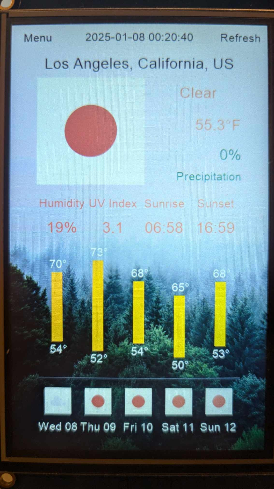
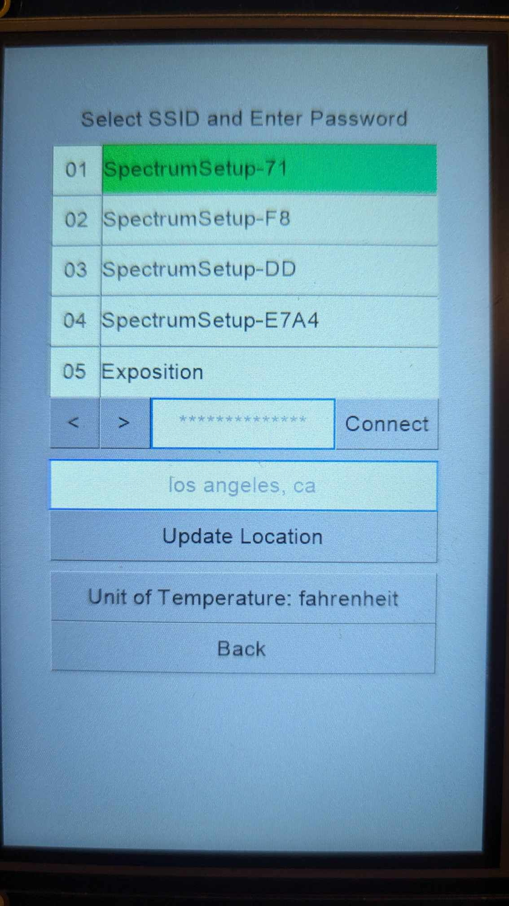
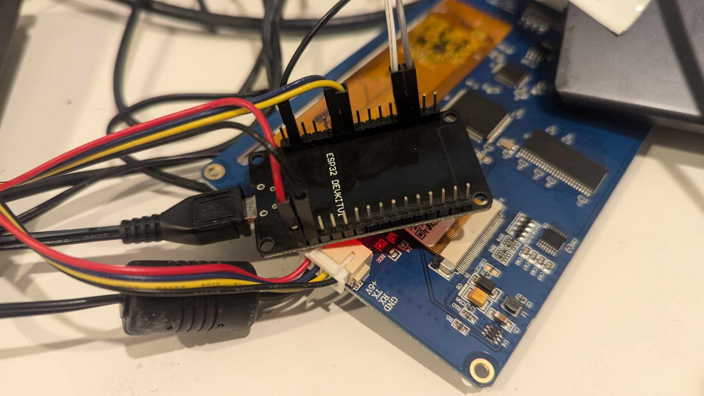

# ESP32 Weather

A weather panel project using ESP32 (Arduino) and Nextion touchscreen.

<div style="display: flex; align-items: center;">
    
    
</div>

Features:
- Weather data fetching from Open-Meteo API
- Utilizes WiFi library for network connection management
- Utilizes Nextion GUI designing commands to draw 5-day weather bar chart
- Automatic location detection via IPInfo.io API
- Geocoder for location name resolution via Nominatim API

Hardware:
- Raspberry Pi Zero WH
- Nextion NX8048T050 display
- USB to TTL adapter (IZOKEE CP2102 in this project)
- power supply

Demo:

[https://www.youtube.com/watch?v=S042fLQz42w](https://www.youtube.com/watch?v=S042fLQz42w)

## Setup Steps

### Setup Nextion Display
1. Install Nextion Editor and open `./display/NX8048T050/project.HMI` in the editor. You can use "Debug" button to simulate the display and check if any error occurs.
2. Install the driver for the USB to TTL adapter. Connect the display to your computer using a USB to TTL adapter. Note TX of the display should be connected to RX of the adapter and vice versa.
3. Push the "Upload" button in the Nextion Editor to upload the project to the display. If the display is not detected, check the connection and the driver installation.
4. Disconnect the display from the adapter and connect it to the UART2 of ESP32. 5V of the display should be connected to VIN of ESP32.  
   

### Setup Arduino IDE and ESP32

1. Plug ESP32 to power supply and connect UART0 to USB to TTL adapter, then connect the adapter to your computer. UART0 is for programming and debugging, and UART2 is for the display.
2. Install Arduino IDE and ESP32 board such as additional board manager URL, boards manager, etc.
3. Open `./arduino/arduino.ino` in Arduino IDE. Open serial monitor to check if it can access COM or ttyUSB port. If not, check the connection, driver installation, or permission.
4. Press EN and BOOT buttons on ESP32 to enter the bootloader mode, the serial monitor should show `waiting for download`.
5. Press the "Upload" button in Arduino IDE to upload the sketch to ESP32. After the upload is done, press the EN button to restart the ESP32.
6. (Optional) Setup initial WiFi SSID and password in the `setup()` in `arduino.ino`.
    ```cpp
    // Optionally set initial WiFi.
    wifiMulti.addAP("SSID", "PASSWORD");
    while (wifiMulti.run() != WL_CONNECTED) { delay(500); }
    ```

## Image sources
- background: Goč, Serbia by Filip Zrnzević on Unsplash
- weather icons: https://openweathermap.org/weather-conditions